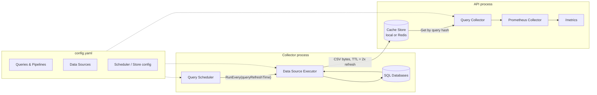

# Architecture

The exporter is split into two loosely-coupled halves that communicate only through a **cache
store**: a **collector loop** that keeps query results fresh, and an **API** that serves whatever
is currently in the cache to Prometheus. Neither half ever blocks on the other.

## Components

### Application (`internal/initiator`)

`Application` is the composition root: it reads `config.ApplicationConfig`, builds every data
source, wires up the cache store and scheduler storage, loads all `queries:` into `schema.Query`
objects, and exposes two independent entry points:

- `StartCollector()` — starts the query scheduler, which begins running queries on their configured
  intervals.
- `StartApi()` — starts the HTTP server and registers the Prometheus collector against a
  `prometheus.Registry`.

Both are gated by `enableCollector` / `enableApi` in the config, which lets you run collector-only
and API-only processes against a shared Redis cache and scheduler storage — see
[Standalone Exporter](getting-started/creating-standalone-exporter.md) for when you'd want that
split versus running both in one process.

### Query Scheduler (`internal/queryscheduler`, `pkg/go-scheduler`)

On `Init()`, every `schema.Query` is hashed (name + SQL + labels + metrics — see
[`Query.GenerateHash`](https://github.com/hamzausmani302/prometheus-database-exporter/blob/main/internal/schema/query.go))
and registered with the underlying scheduler library to run every `queryRefreshTime` seconds. Each
tick calls `ExecuteTask`, which:

1. Resolves the query back to its live, canonically-loaded instance (tasks reloaded from persistent
   scheduler storage are reconstructed via JSON and can't carry unexported fields like the live data
   source connection).
2. Runs the query (or pipeline) through the **Data Source Executor**.
3. Serializes the result to CSV and stores it in the cache store under the query's hash, with a TTL
   of `2 * queryRefreshTime` seconds — long enough to survive one missed tick without the metric
   disappearing from `/metrics`.

The scheduler's own bookkeeping (which tasks are registered, when they last ran) is persisted
separately via `schedulerConfig.storage` (`memory`, `sqlite`, `redis`, or `postgres`) — this is
distinct from the cache store that holds query *results*.

### Data Source Executor (`internal/datasource/executor`)

Given a `schema.Query`, the executor either:

- runs `query.Query` directly against the data source named in `dataSource`, or
- if the query defines a `pipeline:` block instead, builds and runs a `schema.Pipeline`.

Either way it returns a single [gota](https://github.com/go-gota/gota) `DataFrame`.

### Pipelines & Stages

Defined in `internal/schema/pipeline.go` and `stage.go`. A pipeline is a small DAG of **stages**,
each producing a DataFrame consumed by later stages. This
exists for metrics that a single SQL query can't express cleanly — typically "for every row in
table A, run a per-row query against table B, then combine the results."

| Stage type | Behavior |
|---|---|
| `extract` | Runs a plain SQL query against a named data source. No inputs required. |
| `foreach` | Takes one input stage's output; for every row, substitutes `{{columnName}}` placeholders in its own query with that row's values, runs it, and concatenates all per-row results (propagating input columns not already present in the result). |
| `rename` | Renames a column on its single input stage's output. |

Stages are built in two passes (all stages created and indexed by `stageId`, then
`inputStageIds` resolved to real references), then executed in dependency order via a depth-first
post-order traversal — so every stage's inputs are guaranteed to have already run. The last stage
in that order is the pipeline's result. See [Examples](examples.md) for a full `foreach` pipeline.

### Cache Store (`pkg/cache`)

An `ICache` with two implementations:

- **`local`** — an in-process, TTL-aware map. Simplest option; fine for a single standalone
  process, but each replica has its own independent cache.
- **`redis`** — shared cache, required if the collector and API run as separate processes/replicas
  (they must agree on where query results live).

### Query Collector → Prometheus Collector (`internal/collector`)

`QueryCollector` reads each query's cached CSV by hash, turns it into
`CollectorMetric` values — one per (metric × row), with labels resolved either from a column
value or a configured static value — and deduplicates by (metric name, label set), keeping the
last value if a query returns the same series twice.

`PrometheusGoCollector` wraps that in the `prometheus.Collector` interface (`Describe`/`Collect`),
naming every emitted series `<query.name>_<metric.name>` and currently exporting everything as a
Prometheus `Gauge`, regardless of the `type:` set in config (only `GAUGE` is meaningful today).

### HTTP surface

The API process always exposes two endpoints on a fixed port, **`:2112`**:

- `/metrics` — the registered `PrometheusGoCollector`, i.e. your configured query metrics.
- `/app-metrics` — the Go process's own runtime metrics (via `promhttp.Handler()`), useful for
  monitoring the exporter itself.

The `serverConfig` block that appears in the example configs (`port`, `numWorkers`) is not yet
wired up to this listener — the port is fixed at `2112` today.

## Configuration → components map

| Config block | Feeds into |
|---|---|
| `dataSourceConfig` | `internal/factories.DatasourceFactory` → one `IDataSource` per entry (currently `SQL`/Postgres, via `internal/datasource`) |
| `storeConfig` | `internal/factories.CacheStoreFactory` → the cache store queries results are written to and read from |
| `schedulerConfig` | `internal/factories.SchedulerStorageFactory` → where the scheduler persists its own task bookkeeping |
| `queries` | `schema.LoadMany` → `[]*schema.Query`, each scheduled independently |
| `enableApi` / `enableCollector` | Which of `StartApi()` / `StartCollector()` the process runs |

See [Configure a Data Source](getting-started/configure-data-source.md) for the full field-by-field
reference of these blocks.
